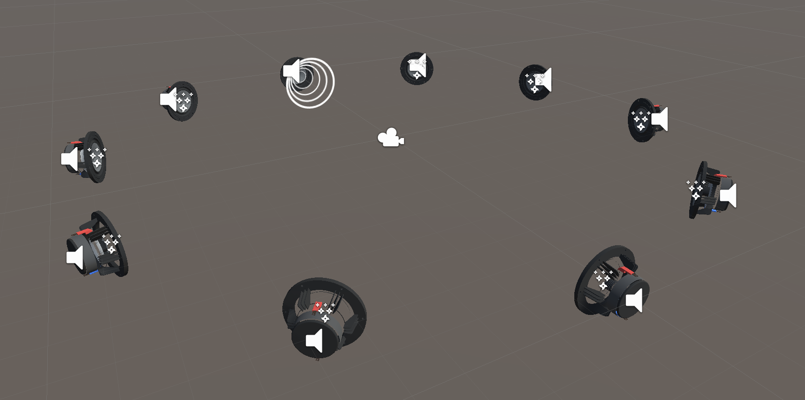

# Unity Spatial Audio Demo

> This demo project is used to audit the performance and quality of spatial audio plugins for Unity in VR and AR.

## Unity Plugins

| Name | URL |
| ---- | --- |
| Unity (default) | <https://docs.unity3d.com/Manual/AudioSpatializerSDK.html> |
| Oculus Spatializer Unity | <https://developer.oculus.com/downloads/package/oculus-spatializer-unity/> |
| Google Resonance Audio | <https://resonance-audio.github.io/resonance-audio/> |
| Steam Audio | <https://valvesoftware.github.io/steam-audio/downloads> |
| Microsoft MixedRealityToolkit | <https://github.com/Microsoft/MixedRealityToolkit-Unity/tree/master/Assets/HoloToolkit/SpatialSound> |
| Tazman-Audio's Microsoft Audio Spatializer | <https://developer.dolby.com/blog/tazman-audio-unity-plugin-for-atmos/> , <https://assetstore.unity.com/packages/tools/audio/microsoft-audio-spatializer-116094> |
